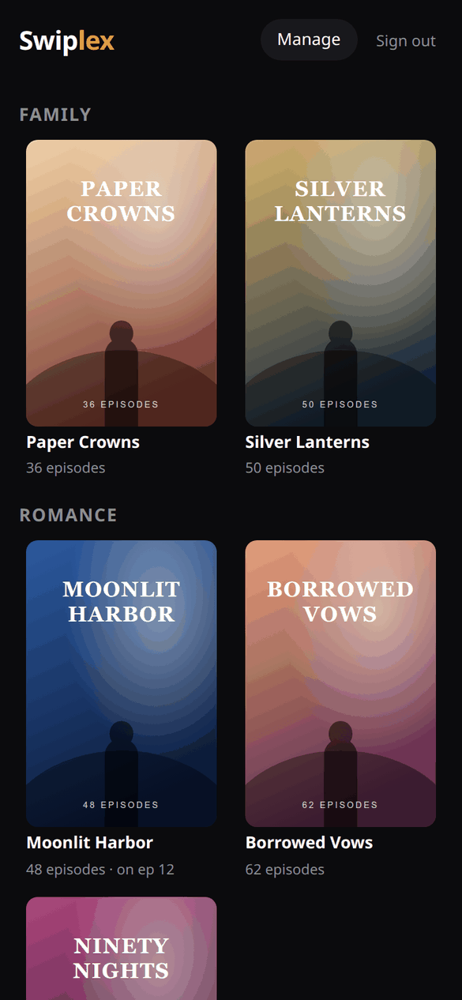
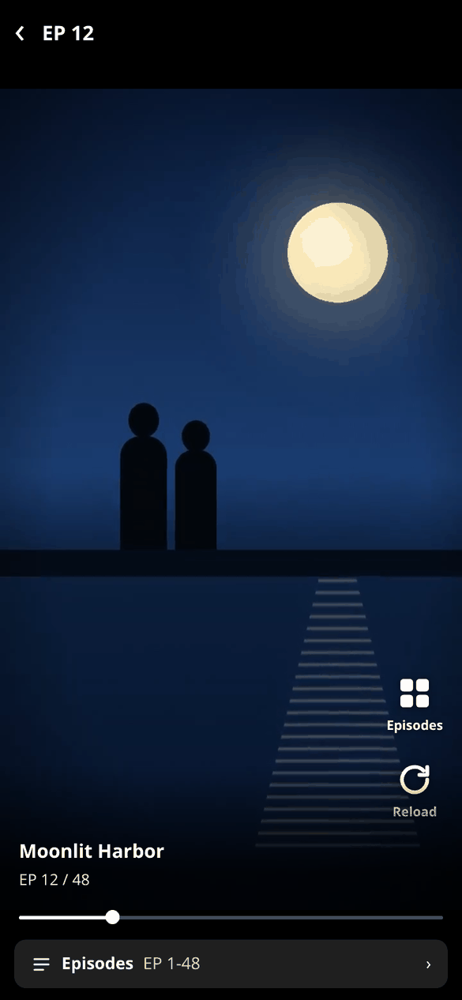
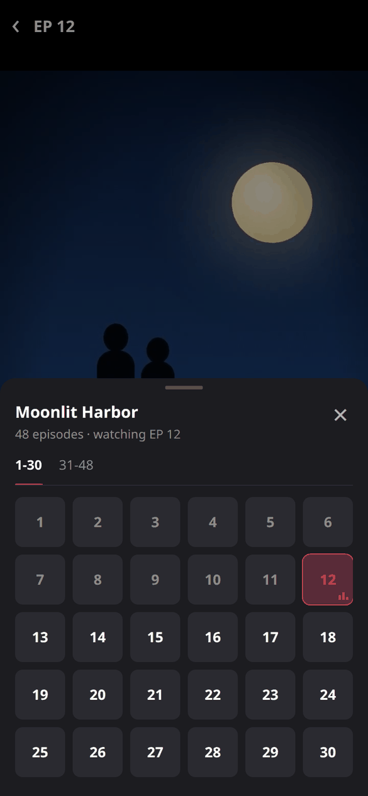
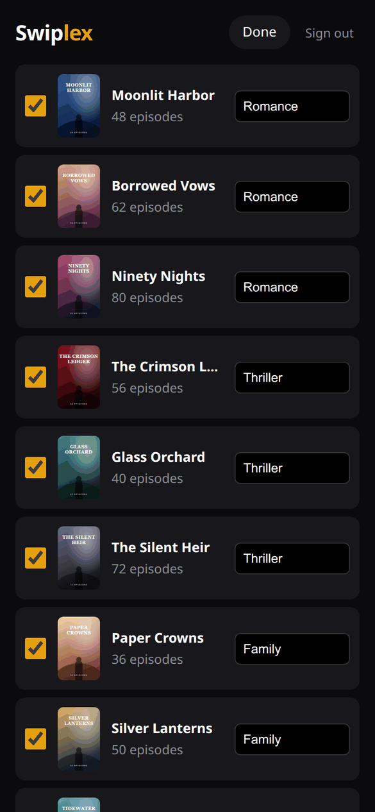

# Swiplex

**Swipe through the TV shows on your Plex server, one episode per screen.**

Swiplex is a small, self-hosted web app that turns your Plex TV library into a
vertical, TikTok-style player: open a show, swipe up for the next episode, and pick
up where you left off. It is made for short-episode series (web series, short
dramas, anime shorts), but works with any show in your Plex library.

<p align="center">
  
  
  
  
</p>

<sub>Screenshots use a made-up demo library (invented titles and artwork).</sub>

## Features

- **Swipe player**: full-screen, one episode per screen, auto-advance, a seek bar,
  a tap to pause, and an episode picker that marks what you have watched.
- **Resume**: remembers the episode and position per show (per browser).
- **Sign in with Plex**: everyone uses their own Plex account. Only accounts that
  have access to your server get in, and each one sees only what Plex lets them see.
- **You curate**: the server owner picks which shows appear and groups them into
  categories. Other users just watch.
- **Plays anything Plex can serve**: H.264 MP4 plays directly; everything else is
  streamed through Plex's transcoder (HLS).
- **Private by design**: Plex tokens never reach the browser. All media is proxied
  through Swiplex, and the app talks only to your Plex server and plex.tv.
- **Tiny**: one Node.js file with no dependencies, plus a static front end.
  Installable on your phone's home screen.

## Requirements

- A Plex Media Server with at least one **TV Shows** library.
- Docker, or Node.js 20 or later.
- Swiplex must be able to reach your Plex server over the network (for example
  `http://192.168.1.10:32400`).

## Quick start

### Docker Compose

```bash
git clone https://github.com/oscarlopezalegre/swiplex.git
cd swiplex
cp docker-compose.example.yml docker-compose.yml
# edit PLEX_URL (and PUBLIC_URL if you use a domain), then:
docker compose up -d --build
```

Open `http://<your-host>:8787`, sign in with the Plex account that **owns** the
server, tap **Manage**, and tick the shows you want, giving each one a category.

If Plex runs in the same Compose project, point Swiplex at its service name:
`PLEX_URL: http://plex:32400`.

### Docker

```bash
docker build -t swiplex .
docker run -d --name swiplex -p 8787:8787 \
  -e PLEX_URL=http://192.168.1.10:32400 \
  -v "$PWD/data:/data" \
  swiplex
```

### Node.js

```bash
cp .env.example .env    # set PLEX_URL
npm start
```

## Configuration

All settings are environment variables (or a `.env` file next to `server.js`).

| Variable | Default | Description |
|---|---|---|
| `PLEX_URL` | `http://localhost:32400` | Your Plex Media Server, as reachable from Swiplex. |
| `PUBLIC_URL` | *(from the request)* | The address people use to open Swiplex, e.g. `https://swiplex.example.com`. Recommended behind a reverse proxy: it is used as the return address after "Sign in with Plex" and decides whether cookies are marked `Secure`. |
| `PORT` | `8787` | Port to listen on. |
| `HOST` | `0.0.0.0` | Interface to listen on. |
| `DATA_DIR` | `./data` (`/data` in Docker) | Where the show selection and sign-in sessions are stored. |
| `SESSION_DAYS` | `90` | How long a sign-in lasts. |

## Using it behind a reverse proxy (HTTPS)

Swiplex works behind any reverse proxy (Nginx Proxy Manager, Caddy, Traefik, nginx…).

1. Set `PUBLIC_URL` to the public HTTPS address.
2. Make sure the proxy forwards `X-Forwarded-Proto` (most do by default).
3. Don't buffer or time out long responses: videos are streamed through Swiplex.

A plain nginx example:

```nginx
location / {
    proxy_pass http://127.0.0.1:8787;
    proxy_set_header Host $host;
    proxy_set_header X-Forwarded-Proto $scheme;
    proxy_buffering off;
    proxy_read_timeout 1h;
}
```

## Keyboard shortcuts (in the player)

| Key | Action |
|---|---|
| `↓` / `j` | Next episode |
| `↑` / `k` | Previous episode |
| `Space` | Play / pause |
| `←` / `→` | Back / forward 10 seconds |
| `e` | Episode picker |
| `Esc` | Close the picker, then the player |

On touch screens: swipe up and down to change episode, and tap to pause.

## How it works

- **Sign-in** uses Plex's PIN flow, the same one Plex's own apps use. After you
  approve Swiplex on plex.tv, Swiplex checks that your account has access to *this*
  server and stores that server's access token for your session. It never stores
  your plex.tv account token.
- **Who can do what:** anyone with access to the server can watch the shows the
  owner selected, limited to the libraries their own Plex account can see. Only the
  owner sees **Manage**.
- **Streaming:** every image and video request goes through Swiplex, which adds the
  token server-side. Episodes that are H.264 in MP4 play directly (no transcoding);
  others use Plex's HLS transcoder, with one transcode session per viewer.
- **Progress** (last episode, position, watched episodes) is stored in the
  browser's `localStorage`, so it is per device.

## Your data

`DATA_DIR` contains:

| File | Contents |
|---|---|
| `data.json` | The shows you selected and their categories. |
| `sessions.json` | Active sign-ins, **including each user's Plex access token for your server**. Written with `0600` permissions; keep this directory private and out of backups you share. |
| `client.json` | A random identifier for this Swiplex install, required by plex.tv. |

Signing out deletes the session. If a user's access is removed in Plex, their next
request fails and they are signed out automatically.

## Security notes

- Only people whose Plex account has access to your server can sign in.
- Swiplex sends a strict Content-Security-Policy and never exposes Plex tokens to
  the browser.
- Serve it over HTTPS when it is reachable from the internet (see above).
- Swiplex does not add its own rate limiting; put it behind your usual reverse
  proxy protections if you expose it publicly.

## Troubleshooting

- **"That Plex account doesn't have access to this server"**: sign in with the
  owner account, or share the server with that account in Plex first.
- **Sign-in returns to the wrong address**: set `PUBLIC_URL`.
- **Shows load but videos don't play**: check that Swiplex can reach `PLEX_URL`,
  and that the Plex server is allowed to transcode (Settings → Transcoder) for
  files that aren't H.264 MP4.
- **Nothing to watch after signing in**: the owner needs to select shows in
  **Manage** first.
- **Health check**: `GET /healthz` returns `{"ok":true}`.

## Contributing

Issues and pull requests are welcome. The project deliberately stays small: one
dependency-free `server.js` and plain HTML/CSS/JS in `public/`, with no build step.
Please keep it that way, and describe how you tested your change.

## License

[MIT](LICENSE). Swiplex bundles [hls.js](https://github.com/video-dev/hls.js)
(Apache 2.0), see [THIRD_PARTY_NOTICES.md](THIRD_PARTY_NOTICES.md).

Swiplex is an independent project and is not affiliated with or endorsed by Plex, Inc.
